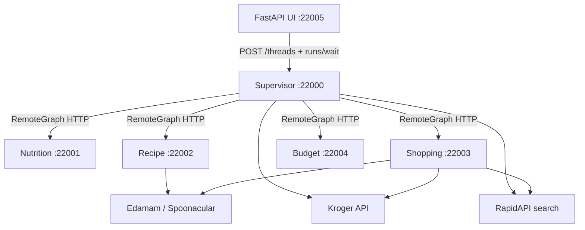
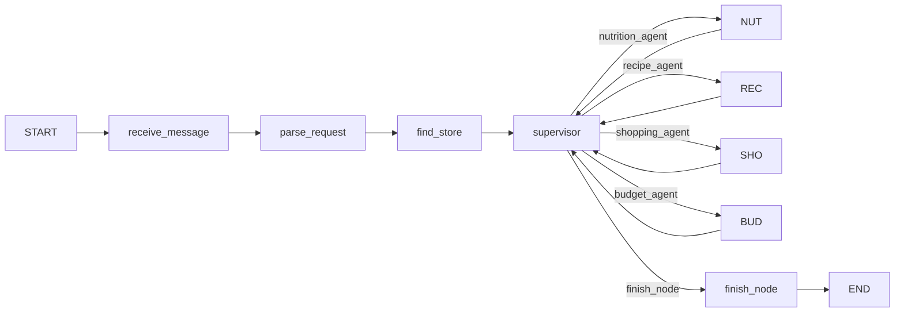

# Personal Shopper — Architecture (live)

> **Maintainers:** Update this file whenever you change agents, graphs, routing, state,
> tools, tracing, or deployment topology. It is the canonical description of the
> **current** system — not a roadmap.

**Last verified:** 2026-05-31

---

## What this system does

A **multi-agent meal-planning and shopping-list** application:

1. Parse a natural-language request (meal, diet, budget, zip, retailer).
2. Find a store (Kroger API or RapidAPI catalog retailers).
3. Find recipes, check ingredient availability, validate budget.
4. Return a markdown shopping list in the chat UI.

Each agent runs as its own **LangGraph server**. A **supervisor** orchestrates them over HTTP via `RemoteGraph`.

---

## High-level topology



| Component | Local port | Graph id | LLM? | External APIs |
|-----------|------------|----------|------|---------------|
| Supervisor | 22000 | `personal_shopper` | Yes (parse) | Kroger / RapidAPI (store lookup) |
| Nutrition agent | 22001 | `nutrition_agent` | Yes | — |
| Recipe agent | 22002 | `recipe_agent` | No | Edamam or Spoonacular |
| Shopping agent | 22003 | `shopping_agent` | No | Kroger or RapidAPI + recipe provider |
| Budget agent | 22004 | `budget_agent` | No | — |
| UI | 22005 | — | No | Proxies to supervisor |

K8s / Docker Compose use port **8000** inside containers; host mapping differs by environment (see [deploy/README.md](../deploy/README.md)).

---

## Supervisor graph

**File:** `supervisor/graph.py`  
**Export:** `graph` — compiled `StateGraph` (not a context manager).

### Flow



### Nodes

| Node | Role |
|------|------|
| `receive_message` | Reset per-run state (`iteration`, recipes, ingredients, `agent_steps`, etc.) |
| `parse_request` | LLM structured extraction → `ShoppingRequest`; merges UI sidebar defaults |
| `find_store` | `find_nearest_store` tool (Kroger or RapidAPI by retailer) |
| `supervisor` | Deterministic routing — sets `next_agent` |
| `nutrition_agent` … `budget_agent` | Thin wrappers: `RemoteGraph.invoke` + merge result |
| `finish_node` | Format markdown shopping list → `AIMessage` |

### Routing rules (`_decide_next_agent`)

Applied in order on each supervisor turn:

1. **Nutrition** — if `dietary_profile` or `max_calories_per_serving` and `nutrition_status == unchecked`
2. **Recipe** — if no `selected_recipes`
3. **Shopping** — if no `shopping_list`
4. **Budget** — if `budget_usd` set and `budget_status == unchecked`
5. **Recipe retry** — if `budget_status == over` or `nutrition_status == fail`, up to `MAX_BUDGET_RETRIES` (3)
6. **Finish** — otherwise

**Safety caps:**

- `MAX_SUPERVISOR_TURNS = 12` — forces `finish_node` to avoid infinite loops
- `iteration` reset to `0` on every new user message (`receive_message` + `parse_request`)

### Design decision: deterministic supervisor, not LLM router

**Why:** Predictable traces, easier debugging for novice developers, no extra LLM cost on every turn. The supervisor is a **rule engine**; sub-agents own domain logic.

---

## Sub-agent graphs

Each sub-agent exports `graph` via `export_traced_graph(...)` — a **context manager** required for LangSmith distributed tracing when called from `RemoteGraph`.

### Nutrition agent (`agents/nutrition_agent/graph.py`)

```
START → interpret_constraints → END
```

- Skips if no profile and no calorie limit.
- LLM converts profile → JSON constraints (`max_carbs_g`, `avoid_ingredients`, etc.).
- Supported profiles: diabetic, low-carb, keto, vegan, vegetarian, gluten-free, dairy-free.

### Recipe agent (`agents/recipe_agent/graph.py`)

```
START → find_recipes → END
```

- Tries keyword queries (meal name → fallback terms).
- Reads `nutrition_constraints` from state: passes `avoid_ingredients` → `exclude_ingredients` and `max_calories` to `search_recipes`.
- On budget retry (`budget_status == over`), prepends `"simple "` to query.
- Provider: `RECIPE_PROVIDER` env (`edamam` default in code paths; `.env.example` shows `spoonacular`).

### Shopping agent (`agents/shopping_agent/graph.py`)

```
START → check_availability → END
```

- `get_recipe_ingredients` per selected recipe.
- `check_product_availability` per ingredient (Kroger vs RapidAPI by retailer).
- `get_ingredient_substitutes` for unavailable items.

### Budget agent (`agents/budget_agent/graph.py`)

```
START → validate_budget → END
```

- Pure Python sum of ingredient prices vs `budget_usd`.
- Sets `budget_status`: `ok` | `over` | skipped if no budget.

---

## Shared state

**File:** `shared/state.py`

All agents share `AgentState` (TypedDict). Key fields:

| Field | Written by | Purpose |
|-------|------------|---------|
| `messages` | UI input, `finish_node` | Chat history (`add_messages` reducer) |
| `request` | `parse_request` | `ShoppingRequest` (Pydantic) |
| `location_id`, `store_name` | `find_store` | Store context |
| `nutrition_constraints` | nutrition agent | Structured diet rules |
| `selected_recipes` | recipe agent | Recipe search results |
| `ingredients`, `shopping_list` | shopping agent | Availability + substitutes |
| `budget_status`, `nutrition_status` | budget / nutrition | Constraint outcomes |
| `constraint_violations` | budget agent | Human-readable violations |
| `iteration` | supervisor | Turn counter per message |
| `refinement_count` | supervisor | Budget/nutrition retry counter |
| `agent_steps` | all agents | Progress trail for UI + traces |
| `next_agent` | supervisor | Router output |

**Design decision:** One shared schema instead of per-agent state types.

**Why:** `RemoteGraph` passes the full state dict over HTTP; a single `AgentState` keeps merges simple (`_merge_remote_result`).

---

## Tools and retailers

**Location:** `src/personal_shopper/tools/`

| Tool module | Functions | When used |
|-------------|-----------|-----------|
| `kroger.py` | `find_nearest_store`, `check_product_availability` | Kroger-family retailers |
| `rapidapi_search.py` | `find_nearest_store`, `check_product_availability` | Walmart, Target, Costco, Amazon, Best Buy |
| `edamam.py` | `search_recipes`, `get_recipe_ingredients`, `get_ingredient_substitutes` | Default recipe provider |
| `spoonacular.py` | same surface | Fallback when `RECIPE_PROVIDER=spoonacular` |
| `mock_tools.py` | same surface | `USE_MOCK_TOOLS=true` — no API keys |

**Design decision:** Imperative `tool.invoke()` inside nodes, not LLM `bind_tools`.

**Why:** Fixed pipelines are cheaper and more reliable than asking the model to pick tools. Trade-off: tool names must be traced explicitly (see below).

**Retailer routing:**

- **Kroger API** — `kroger`, `ralphs`, `king soopers`, `fred meyer`, etc.
- **RapidAPI** — `walmart`, `target`, `costco`, `amazon`, `bestbuy`
- Unknown retailer → defaults to Kroger

---

## LangSmith tracing

### Workspace strategy (org standard)

Three LangSmith **workspaces** isolate traces by trust boundary. **Projects** (`LANGSMITH_PROJECT`) group runs per agent within a workspace.

| Workspace | Sources |
|-----------|---------|
| `team-sandbox` | Local dev, CI eval experiments |
| `team-nonprod` | K8s dev / staging agent servers |
| `team-prod` | Production agent servers |

Workspace is selected by **API key scope** (or `X-Tenant-Id`), not by `LANGSMITH_PROJECT`. CI pipelines **export/import datasets and prompts** between workspaces ([langsmith-migrator](https://github.com/langchain-ai/langsmith-data-migration-tool)); traces are not promoted.

Full rationale, RBAC, and pipeline shape: [DEVELOPER-GUIDE.md §7.14](DEVELOPER-GUIDE.md#714-workspace-strategy-org-standard).

### Distributed tracing (multi-agent)

| Piece | File | Pattern |
|-------|------|---------|
| Supervisor → sub-agent | `supervisor/graph.py` | `RemoteGraph(..., distributed_tracing=True)` |
| Sub-agent export | `shared/distributed_tracing.py` | `export_traced_graph` wraps graph in `ls.tracing_context(parent=...)` |
| Correlation metadata | `supervisor/graph.py` | `_remote_invoke_config` passes `parent_thread_id`, `remote_agent` |

Sub-agent traces appear as **children** of the supervisor trace in one LangSmith project.

### Named tool runs

**File:** `shared/tool_tracing.py` — `invoke_tool()`

Wraps `tool.invoke()` with `run_name`, `tags`, and `metadata` so traces show names like:

```
kroger.find_nearest_store:75035
edamam.search_recipes:palak paneer
kroger.check_product_availability:spinach
```

Used in: `supervisor/find_store`, `recipe_agent/find_recipes`, `shopping_agent/check_availability`.

### UI trace link

**File:** `ui/server.py`

- One LangGraph **thread per chat** (`POST /session` → `thread_id`).
- After `runs/wait`, fetches `run_id` from thread runs API.
- Returns `langsmith_url` + `run_id` to the UI.

---

## UI integration

**Files:** `ui/server.py`, `ui/index.html`

| Feature | Mechanism |
|---------|-----------|
| Constraint sidebar | Prepends silent prefix to message (`[constraints] retailer=walmart; diet=vegan; ...`) |
| Parse merge | Supervisor `_split_ui_prefix_and_body` + `_apply_ui_defaults` |
| Agent steps bar | `agent_steps` from final state |
| LangSmith link | `run_id` / `langsmith_url` in `ChatResponse` |
| Markdown replies | `marked.js` renders `finish_node` output |

Default `LANGGRAPH_URL`: `http://127.0.0.1:22000` (supervisor).

---

## Deployment model (summary)

| Layer | Path | Notes |
|-------|------|-------|
| K8s primitives | `deploy/helm/charts/k8s-primitives/` | Library chart |
| LangGraph chart | `deploy/helm/charts/langgraph-primitives/` | One Helm release per agent |
| Org / env / agent values | `deploy/helm/org/`, `overlays/`, `agents/` | Three-layer values merge |
| Build | `langgraph build` (Wolfi, `image_distro: wolfi`) | Per-agent `langgraph.json` |
| Local K8s | `deploy/scripts/local-k8s-setup.sh` | Namespace `agents-local` |

Per-agent isolation in K8s:

- Redis DB index 0–4 (supervisor → budget)
- Separate Postgres database per agent
- Inter-agent URLs via Helm configmap (`NUTRITION_AGENT_URL`, etc.)

Full detail: [deploy/helm/LAYERS.md](../deploy/helm/LAYERS.md), [deploy/README.md](../deploy/README.md).

---

## Design patterns (quick reference)

| Pattern | Where | Rationale |
|---------|-------|-----------|
| **Supervisor + workers** | `supervisor/` + `agents/*` | Independent deploy, scale, and trace per domain |
| **RemoteGraph over HTTP** | `supervisor/graph.py` | True multi-process agents; matches K8s one-pod-per-agent |
| **Shared TypedDict state** | `shared/state.py` | Simple remote merge; UI reads one shape |
| **Deterministic routing** | `_decide_next_agent` | Debuggable without LLM non-determinism |
| **Structured output parse** | `parse_request` | Reliable `ShoppingRequest` vs free-form JSON |
| **Provider switch via env** | `RECIPE_PROVIDER`, `USE_MOCK_TOOLS` | Mock mode + Edamam/Spoonacular swap without code changes |
| **export_traced_graph** | sub-agents | LangSmith parent/child across process boundary |
| **invoke_tool** | tool call sites | Readable trace names for imperative tools |
| **Per-message state reset** | `receive_message` | Thread checkpoint does not leak prior run state |
| **Budget feedback loop** | supervisor → recipe → budget | Retry cheaper recipes when over budget |

---

## Prompts (externalized)

LLM prompts live in **`shared/prompts/`** as version-controlled markdown files, loaded by `shared/prompt_loader.py`.

| Prompt | Files | Consumer | Template variables |
|--------|-------|----------|-------------------|
| `parse_request` | `parse_request.system.md`, `.human.md` | Supervisor `parse_request` | `{message}` |
| `nutrition_constraints` | `nutrition_constraints.system.md`, `.human.md` | Nutrition agent | `{profile}`, `{calories}` |

**Why files, not LangSmith Prompt Hub (yet):** Editable in git, no extra runtime dependency, works in mock mode and CI without Hub credentials. Hub integration can wrap the same files later.

**Not externalized:** Tool docstrings (`@tool` descriptions) — those are API contracts for LangChain tools, not chat prompts.

See [shared/prompts/README.md](../shared/prompts/README.md) for naming conventions.

---

## Developer documentation

| Doc | Audience |
|-----|----------|
| [docs/DEVELOPER-GUIDE.md](DEVELOPER-GUIDE.md) | Org-wide agentic dev guide (Personal Shopper = reference impl) |
| [docs/agents/README.md](agents/README.md) | External integrators — HTTP API index |
| [docs/agents/API-CONTRACT.md](agents/API-CONTRACT.md) | Shared ``AgentState``, endpoints, auth |
| [docs/agents/*.md](agents/) | Per-agent integration specs (Swagger-style) |
| [docs/TOOLS.md](TOOLS.md) | External API tool catalog |
| [docs/SYSTEM-INVENTORY.md](SYSTEM-INVENTORY.md) | Full file/function inventory, integration, example env, **§13 design asks / decisions / recommendations** |
| In-code docstrings | `shared/`, `supervisor/`, `agents/`, `tools/` |

---

## Repository map

```
personal-shopper/
├── supervisor/graph.py          # Orchestrator (entry graph for UI)
├── agents/
│   ├── nutrition_agent/graph.py
│   ├── recipe_agent/graph.py
│   ├── shopping_agent/graph.py
│   └── budget_agent/graph.py
├── shared/
│   ├── state.py                 # AgentState, ShoppingRequest
│   ├── distributed_tracing.py   # Sub-agent trace export
│   ├── tool_tracing.py          # Named tool runs
│   ├── prompt_loader.py         # Load shared/prompts/*.md
│   └── prompts/                 # Externalized LLM prompts
├── src/personal_shopper/tools/  # @tool integrations
├── ui/                          # FastAPI + chat HTML
├── scripts/
│   ├── dev-multiagent.sh        # Start all agents locally
│   └── multiagent-ports.sh      # Port constants
└── deploy/helm/                 # K8s packaging
```

Each agent has its own `langgraph.json` with `image_distro: wolfi` and `python_version: 3.12`.

---

## Not implemented (intentionally deferred)

Keep this list honest — remove items when built:

| Feature | Status |
|---------|--------|
| Human-in-the-loop (`interrupt` / confirm list) | Env flag only; no graph node |
| LangSmith offline eval gate in CI | Built — `tests/eval/`; parse eval gates CI at 0.70 |
| Cooking instructions agent | Not built |
| Edamam Nutrition Analysis per recipe | Not built |
| Prompt Hub (`hub.pull`) | Not used; prompts are local `shared/prompts/*.md` only |
| OpenAI / provider prompt caching | Not configured; full system prompt sent every LLM call |
| Prompt hot-reload (mtime invalidation) | Not built; edit `.md` → restart agent to pick up changes |
| Annotation queues | Not configured |
| AKS prod CD with approval gate | Overlays exist; workflow not built |
| `staging` Helm overlay | Only `local` / `dev` / `prod` |

---

## Local development quick start

```bash
pip install -e ".[dev]"
cp .env.example .env          # API keys; USE_MOCK_TOOLS=true to skip keys

bash scripts/dev-multiagent.sh   # supervisor :22000, sub-agents :22001–22004

cd ui && python server.py        # :22005, LANGGRAPH_URL=http://127.0.0.1:22000
```

Studio: `https://smith.langchain.com/studio/?baseUrl=http://127.0.0.1:22000`

---

## When you change code, update this doc if you…

- [ ] Add/remove/rename a graph node or agent
- [ ] Change supervisor routing rules or caps (`MAX_*`)
- [ ] Add fields to `AgentState` or `ShoppingRequest`
- [ ] Add a tool, retailer, or recipe provider
- [ ] Change tracing patterns or env vars
- [ ] Change ports, URLs, or Helm agent layout
- [ ] Add or edit prompts in `shared/prompts/` (update `shared/prompts/README.md`)
