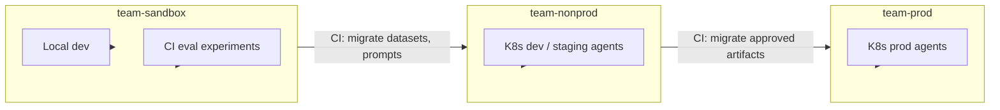
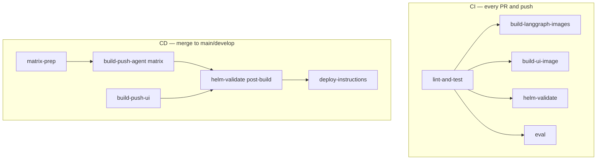

# Agentic Development Guide

> **Audience:** Engineers building multi-agent LLM systems within the organization.  
> **Scope:** LangGraph-based agents deployed as independent services, orchestrated over HTTP, observed via LangSmith.  
> **Reference implementation:** [Personal Shopper](../README.md) — patterns in this repo are the canonical examples.  
> **Project-specific docs:** [ARCHITECTURE.md](ARCHITECTURE.md), [agents/](agents/README.md), [TOOLS.md](TOOLS.md).

This guide is **generic by design**. Apply it to any agentic product; use Personal Shopper when you need a concrete worked example.

**Deep dives:** [§7 LangSmith](#7-langsmith-observability--evaluation) · [§8 Testing](#8-testing-strategy) · [§9 CI/CD](#9-cicd-practices) · [§11 Documentation](#11-documentation-standards) · [Appendix A](#appendix-a--personal-shopper-reference)

---

## 1. Core principles

These apply to every agentic project, regardless of domain.

| Principle | Practice |
|-----------|----------|
| **Know your workflow** | If the end-to-end path is understood (parse → enrich → act → validate → respond), encode it explicitly. Do not delegate control flow to an LLM by default. |
| **LLM for ambiguity, code for certainty** | Use models for natural language, classification, and open-ended reasoning. Use deterministic code for routing, arithmetic, API sequencing, and policy enforcement. |
| **One capability, one deployable** | Split agents by domain boundaries that matter for scaling, failure isolation, team ownership, and release cadence — not by arbitrary file count. |
| **Explicit contracts** | Shared state schemas, HTTP API specs, and tool I/O must be typed, documented, and versioned in git. No implicit coupling between agents. |
| **Observable by default** | Every agent handoff, LLM call, and external integration must appear in traces with human-readable names. |
| **Testable without production keys** | Unit tests and CI must run in mock mode. Live API keys are for eval and manual testing only. |
| **Docs ship with code** | Architecture, API contracts, and prompt changes belong in the same PR as the implementation. |

---

## 2. When to use which pattern

### 2.1 Single graph vs multi-agent

| Situation | Recommendation |
|-----------|----------------|
| One team, one release, simple flow | Single LangGraph graph may suffice |
| Distinct domains (search, validation, formatting) | Separate agent graphs |
| Different scale or SLA per capability | Separate deployables |
| Multiple teams owning parts of the flow | Separate agents + clear HTTP contracts |
| Need to call one capability from multiple products | Expose sub-agents directly |

### 2.2 Orchestrator styles

| Style | Use when | Avoid when |
|-------|----------|------------|
| **Deterministic router** (rule engine on state flags) | Pipeline is known; routing depends on structured state | Users frequently change goals mid-conversation |
| **LLM router** | Dynamic tool/agent selection; exploratory workflows | Cost, latency, or reproducibility are critical |
| **Hybrid** | Fixed happy path + LLM only on failure/replan | — (good upgrade path from deterministic) |

**Org default:** Start deterministic. Add LLM routing only with a documented requirement.

### 2.3 LLM tool-calling vs imperative tools

| Approach | Use when | Trade-off |
|----------|----------|-----------|
| **Imperative** (`tool.invoke()` in graph nodes) | Fixed pipelines, known call order, cost sensitivity | Graph code changes when tools change |
| **LLM `bind_tools`** | Model must choose among many tools dynamically | Less predictable, harder to test, opaque traces |

**Org default:** Imperative tools inside nodes, with named trace spans. Reserve LLM tool-calling for genuinely open-ended agent loops.

### 2.4 In-process vs remote agents

| Approach | Use when |
|----------|----------|
| **In-process** (import graph directly) | Local prototyping, single-process tests |
| **Remote** (`RemoteGraph` over HTTP) | Production, K8s, independent scaling, true multi-agent |

**Org default:** Develop nodes in-process; deploy and integrate via HTTP. Production orchestrators must not import worker graphs.

---

## 3. Standard architecture

### 3.1 Supervisor + workers

```
Client → Entry agent (orchestrator) → HTTP → Worker agents → HTTP → ...
```

- **Entry agent:** Parses or normalizes input, routes to workers, merges results, formats output.
- **Worker agents:** Single-domain graphs (search, enrichment, validation, generation).
- **Clients** (UI, API consumers) call the entry agent unless they need a single capability.

```
Example (Personal Shopper):
UI → Supervisor → Nutrition | Recipe | Shopping | Budget
```

### 3.2 Shared state

Use one **typed state schema** across all agents in a product:

- **Graph state** (`TypedDict`): Fields agents read/write; passed over HTTP on remote calls.
- **Structured models** (`Pydantic`): LLM extraction outputs and domain entities.
- **Partial updates:** Nodes return `dict` fragments; the framework merges them.

**Rules:**

1. Every field has a documented **writer** and **reader(s)**.
2. Add fields only when multiple components need them.
3. Include a **progress trail** field (e.g. `agent_steps: list[str]`) for UI and debugging.
4. Include **status flags** (e.g. `budget_status: unchecked | ok | fail`) for routing.
5. Reset per-run fields at the start of each user turn — checkpointed threads leak state otherwise.

### 3.3 Routing

Express routing as a pure function over state:

```python
def decide_next(state: AgentState) -> str:
    if state["enrichment_status"] == "unchecked" and needs_enrichment(state):
        return "enrichment_agent"
    if not state.get("results"):
        return "search_agent"
    if state.get("validation_status") == "fail" and state["retry_count"] < MAX_RETRIES:
        return "search_agent"
    return "finish"
```

Always cap loops: `MAX_TURNS`, `MAX_RETRIES`. Never rely on the model to “know when to stop.”

### 3.4 Feedback loops

When validation fails, route back to an earlier stage with context:

1. Worker sets a status flag and optional `constraint_violations`.
2. Router reads the flag and increments `retry_count`.
3. Re-invoke upstream worker with adjusted inputs (e.g. simpler query, stricter filters).
4. Stop at `MAX_RETRIES` and finish with a partial result or user-visible error.

### 3.5 Skip paths

When a worker has nothing to do, record it explicitly:

```python
steps.append("validation_agent:skipped")
return {"validation_status": "ok", "agent_steps": steps}
```

Silent no-ops produce empty traces and confuse operators.

---

## 4. Project structure (recommended layout)

Adapt names to your product; keep the separation of concerns:

```
<product>/
├── <entry>/graph.py              # Orchestrator
├── agents/<name>/graph.py        # Worker graphs
├── agents/<name>/langgraph.json  # Build + graph registration
├── shared/
│   ├── state.py                  # Shared state + Pydantic models
│   ├── prompts/                  # Version-controlled LLM prompts
│   ├── prompt_loader.py
│   ├── distributed_tracing.py    # Sub-agent trace nesting
│   └── tool_tracing.py           # Named spans for imperative tools
├── src/<product>/tools/          # External API integrations + mocks
├── deploy/
│   ├── agents.manifest.yaml      # Canonical agent registry (CI/CD)
│   └── helm/agents/<name>/       # Per-agent deployment config
├── tests/unit/                   # Fast tests, mock mode
├── tests/eval/                   # LangSmith offline evals
└── docs/
    ├── ARCHITECTURE.md           # Live system design
    ├── DEVELOPER-GUIDE.md        # This file
    └── agents/                   # HTTP integration specs
```

**Conventions:**

- One container image per agent registry entry.
- `shared/` holds cross-agent code only — no domain logic.
- `docs/agents/` holds Swagger-style HTTP specs for external integrators.

---

## 5. Implementation patterns

### 5.1 Graph module template

```python
"""<Agent name> — <one-line purpose>. Integration spec: docs/agents/<name>.md"""

def node_fn(state: AgentState) -> dict:
    """Read X from state; return partial update with Y."""

def build_graph() -> CompiledGraph:
    builder = StateGraph(AgentState)
    builder.add_node("node_fn", node_fn)
    builder.add_edge(START, "node_fn")
    builder.add_edge("node_fn", END)
    return builder.compile()

_compiled = build_graph()
# Entry agent:  graph = _compiled
# Worker agent: graph = export_traced_graph(_compiled, "<agent_tag>")
```

### 5.2 Lazy LLM initialization

Never instantiate LLMs at module import time — tests and CI import graphs without API keys.

```python
_LLM = None

def get_llm():
    global _LLM
    if _LLM is None:
        _LLM = ChatOpenAI(model="gpt-4o-mini", temperature=0)
    return _LLM
```

### 5.3 Structured extraction

Prefer `with_structured_output(PydanticModel)` over prompting for JSON. Use temperature 0 for extraction and classification.

### 5.4 Imperative tools with named traces

```python
result = invoke_tool(
    external_api_call,
    {"param": value},
    provider="provider_name",
    label=f"provider.tool_name:{value}",
)
```

Trace names should answer: *what ran, on what input, from which provider?*

### 5.5 Remote agent invocation

```python
remote = RemoteGraph("<graph_id>", url=AGENT_URL, distributed_tracing=True)
result = remote.invoke(state, config=correlation_config)
```

Pass parent `thread_id`, `run_id`, and agent name in metadata for cross-service trace correlation.

### 5.6 Sub-agent trace export

Worker agents wrap the compiled graph so child runs nest under the parent trace:

```python
graph = export_traced_graph(_compiled, "worker_agent_tag")
```

Pair with `distributed_tracing=True` on the caller's `RemoteGraph`.

### 5.7 Defensive state access

After HTTP round-trips, structured fields may be `dict` or Pydantic. Handle both:

```python
req = state.get("request") or {}
value = req.get("field") if isinstance(req, dict) else getattr(req, "field", None)
```

### 5.8 Environment-driven configuration

| Concern | Pattern |
|---------|---------|
| API keys | Environment variables / K8s secrets — never in code |
| Provider choice | `PROVIDER=x` env var with sensible default |
| Mock mode | `USE_MOCK_TOOLS=true` swaps all tools to fixtures |
| Agent URLs | `<AGENT>_URL` per remote worker |
| Feature flags | Env or configmap — not hardcoded booleans |

---

## 6. Prompt management

### 6.1 Externalize prompts

Store prompts in version-controlled files (e.g. `shared/prompts/<name>.system.md`), not inline in Python.

| Benefit | Why it matters |
|---------|----------------|
| PR review | Prompt changes are visible in diffs |
| Non-dev editing | Technical writers can propose prompt PRs |
| Reproducibility | Prompt version = git SHA |
| CI without Hub | No runtime dependency on prompt hosting services |

### 6.2 Conventions

- One job per prompt pair (system + human/user template).
- Use framework escaping for literal braces in examples (`{{` `}}`).
- Document template variables in a prompts README.
- Restart agents after prompt edits unless hot-reload is implemented.

### 6.3 When to adopt Prompt Hub

Consider LangSmith Prompt Hub when non-engineers need to edit prompts without git access, or when you need environment-specific prompt versions at scale. Until then, git-backed prompts are the org default.

---

## 7. LangSmith observability & evaluation

[LangSmith](https://docs.smith.langchain.com/) is the org standard for LLM tracing, debugging, and offline evaluation on LangGraph agents. This section maps **LangSmith developer recommendations** to patterns — noting what this reference project implements today and what is deferred.

Official references: [Trace LangGraph](https://docs.langchain.com/langsmith/trace-with-langgraph) · [Distributed tracing](https://docs.langchain.com/langsmith/agent-server-distributed-tracing) · [Evaluate graphs](https://docs.langchain.com/langsmith/evaluate-graph)

### 7.1 Environment setup

LangSmith tracing is enabled via environment variables on **every agent process** (supervisor and workers):

| Variable | Purpose | Reference impl |
|----------|---------|----------------|
| `LANGSMITH_TRACING` | `true` / `false` | `true` in prod; `false` in unit tests |
| `LANGSMITH_API_KEY` | Auth to LangSmith Cloud | K8s secret + GitHub secret for CI eval |
| `LANGSMITH_PROJECT` | Groups traces in the UI | Per-env / per-agent in Helm (`langsmith.project`) |
| `LANGSMITH_ENDPOINT` | API base URL | `https://api.smith.langchain.com` |

**LangSmith recommendation:** Use **tracing projects** (`LANGSMITH_PROJECT`) to group runs by agent or product within a workspace. Use **workspaces** for trust boundaries between teams or sensitivity tiers — see [§7.14](#714-workspace-strategy-org-standard).

**Implemented today (transitional):** `personal-shopper-dev` locally; `personal-shopper-ci` in CI eval job; per-agent `langsmith.project` in Helm. Target state: three workspaces below.

**Unit tests / fast CI:** Set `LANGSMITH_TRACING=false` — LangSmith docs support disabling tracing where latency and offline runs matter.

### 7.2 LangGraph auto-tracing

**LangSmith recommendation:** When using LangChain modules inside LangGraph, set env vars and call runnables normally — LangSmith infers trace config for LLM and chain runs.

**Implemented:** `parse_request` and `interpret_constraints` use `chat_prompt() | llm` — LLM calls appear automatically under their graph node in LangSmith.

**Not configured:** `LANGCHAIN_CALLBACKS_BACKGROUND` — optional LangSmith tuning for serverless vs long-running servers. Wolfi agent pods are long-running; default callback behaviour is sufficient today.

### 7.3 Wrap custom code with readable run names

**LangSmith recommendation:** Custom functions and imperative tool calls should produce named spans — not anonymous `tool` runs — so the trace tree is debuggable.

**Implemented:** `shared/tool_tracing.invoke_tool()` passes `RunnableConfig(run_name=..., tags=..., metadata=...)`:

```
kroger.find_nearest_store:75035
edamam.search_recipes:palak paneer
kroger.check_product_availability:spinach
```

Convention: `{provider}.{tool_name}:{input_summary}` with tags `tool`, `{provider}`.

Pure-Python nodes (e.g. budget validation) appear as graph nodes only — no `invoke_tool` spans, which is expected.

### 7.4 Distributed tracing (multi-agent)

**LangSmith recommendation:** For `RemoteGraph` / Agent Server calls, **both client and server must opt in**. The client sends `langsmith-trace` and project headers; the server nests its runs under the parent.

| Side | LangSmith guidance | Reference impl |
|------|-------------------|----------------|
| **Client** | `RemoteGraph(..., distributed_tracing=True)` | `supervisor/graph.py` → `_remote()` |
| **Server** | Read `langsmith-trace`, `langsmith-project`, metadata/tags from `config["configurable"]`; set tracing context | `shared/distributed_tracing.py` → `export_traced_graph()` + `ls.tracing_context(parent=...)` |

Worker agents export `graph` as a **context manager factory**, not a bare compiled graph — required for nesting.

**Correlation metadata** (beyond LangSmith headers): `_remote_invoke_config()` adds `parent_thread_id`, `parent_run_id`, and `remote_agent` to child run metadata for cross-service debugging.

Documented for integrators: [API-CONTRACT.md §Distributed tracing headers](agents/API-CONTRACT.md#distributed-tracing-headers).

### 7.5 Threads, sessions, and tags

**LangSmith recommendation:** Use consistent metadata and tags so traces are searchable and grouped by conversation.

**Implemented** (`ui/server.py`):

| Mechanism | Value |
|-----------|-------|
| LangGraph `thread_id` | One UUID per UI chat session |
| `metadata.session_id` / `conversation_id` | Same as `thread_id` |
| `tags` | `thread:{first_8_chars}` |
| Trace URL | After `/runs/wait`, fetch latest `run_id` from thread runs API → `langsmith_url` in response |

LangGraph `run_id` equals the LangSmith root run UUID — use it to deep-link from your UI to the trace.

### 7.6 Trajectory vs final output

**LangSmith recommendation:** Evaluate **intermediate steps** (trajectory), not only final answers — especially for agents where routing and tool use matter.

**Implemented via state (preferred for this architecture):**

- `agent_steps` in `AgentState` records the high-level path (`supervisor→recipe_agent`, `recipe_agent:iter1`, `budget_agent:skipped`).
- UI renders the steps bar; LangSmith shows node-level spans under the same run.

**Also available:** LangSmith `Run` objects in evaluators expose full node I/O if you need deeper trajectory checks — not used in current evaluators but supported by the platform.

### 7.7 Debugging workflow

1. Reproduce with a known `thread_id` (UI session or API `config.configurable.thread_id`).
2. Open `langsmith_url` from the UI response, or search LangSmith by tag `thread:xxxxxxxx`.
3. Read `agent_steps` in final state for the routing summary.
4. Expand the trace tree: supervisor node → remote child runs → LLM / `invoke_tool` spans.
5. For sub-agent issues, filter metadata `remote_agent` or follow nested child trace.

### 7.8 Offline evaluation (`evaluate()`)

**LangSmith recommendation:** Use versioned **datasets** and `langsmith.evaluate()` (or `aevaluate`) to regression-test LLM behaviour in CI and during development.

**Implemented** (`tests/eval/`):

| Dataset | Target | Evaluators |
|---------|--------|------------|
| `request-parsing-v1` | `parse_request` node | `check_parse_schema` (heuristic) — **CI gate** |
| `recipe-relevance-v1` | `find_recipes` node | `check_recipe_returned` + `judge_recipe_relevance` (LLM judge) |
| `substitution-quality-v1` | `check_availability` | `judge_substitution` (LLM judge) |

**LangSmith recommendation:** Evaluate **individual nodes** when possible — faster and cheaper than full multi-agent runs.

**Implemented:** `run_parse_eval.py` calls `parse_request` directly with no sub-agents or HTTP. Recipe/substitution evals call single agent nodes with `USE_MOCK_TOOLS=true`.

**Experiment hygiene** (LangSmith best practice):

```python
evaluate(
    run_agent,
    data="request-parsing-v1",
    evaluators=[check_parse_schema],
    experiment_prefix="ci-pr-42",           # group runs in UI
    max_concurrency=2,                      # throttle parallel eval
    metadata={"eval_type": "parse_schema", "mode": "mock"},
)
```

### 7.9 Evaluator design (LangSmith-aligned)

**LangSmith recommendation:** Combine **deterministic checks** (hard constraints) with **LLM-as-judge** (subjective quality).

| Type | When | Reference impl |
|------|------|----------------|
| **Heuristic** | Schema, field equality, presence | `check_parse_schema`, `check_recipe_returned` |
| **LLM-as-judge** | Relevance, substitution quality | `judge_recipe_relevance`, `judge_substitution` |

Heuristic evaluators return `{"score": 0|1, "comment": "...", "key": "..."}` — use descriptive `comment` on failure so LangSmith experiment rows are actionable.

LLM judges use a fixed rubric prompt and normalize scores to 0–1. Reserve for evals where heuristics cannot capture quality.

**CI policy:** Gate merges on heuristic evals first; keep LLM-judge evals informational until baselines stabilize (LangSmith recommends establishing offline baselines before tightening production gates).

### 7.10 Dataset seeding

**LangSmith recommendation:** Maintain datasets that reflect **real failure modes** (edge cases, UI prefixes, ambiguous input) and seed them reproducibly.

**Implemented:** `tests/eval/seed_datasets.py` — idempotent create/update of three datasets. CI runs seed before eval so new examples are added without duplicating.

**Not implemented:** Creating datasets **from production traces** in LangSmith UI (“Add to dataset”) — recommended as a team workflow for growing eval coverage over time.

### 7.11 CI eval job pattern

**Implemented** (`.github/workflows/ci.yaml` → `eval` job):

```yaml
env:
  LANGSMITH_TRACING: "true"
  LANGSMITH_PROJECT: personal-shopper-ci
  LANGSMITH_API_KEY: ${{ secrets.LANGSMITH_API_KEY }}
  USE_MOCK_TOOLS: "true"
```

| Step | Purpose |
|------|---------|
| `seed_datasets.py` | Idempotent dataset sync |
| `run_parse_eval.py --ci --threshold 0.70` | **Blocks** on schema regression |
| `run_recipe_eval.py` / `run_substitution_eval.py` | Informational (`continue-on-error`) |

**Implemented:** `preflight.skip_if_no_openai()` — skips eval when secrets absent (avoids false 0.00 scores on forks).

### 7.12 LangSmith recommendations — not yet implemented

Be explicit about gaps so teams do not assume features exist:

| LangSmith capability | Status | When to adopt |
|---------------------|--------|---------------|
| **Prompt Hub** (`hub.pull`) | Not used — prompts in `shared/prompts/*.md` | Non-dev prompt editors, env-specific prompt versions |
| **Online / production evals** | Not configured | Monitor live traffic quality |
| **Annotation queues** | Not configured | Human review of failed traces |
| **User feedback scores** on traces | Not configured | Thumbs up/down in UI → LangSmith scores |
| **Dataset from traces** | Manual process only | Grow eval sets from prod failures |
| **Trace sampling** | Not configured | Very high volume prod traffic |
| **Self-hosted LangSmith on AKS** | Cloud only today | GRC / data residency requirements |

See [ARCHITECTURE.md §Deferred](ARCHITECTURE.md#not-implemented-intentionally-deferred) and [SYSTEM-INVENTORY.md §13.4](SYSTEM-INVENTORY.md#134-deferred--known-gaps).

### 7.14 Workspace strategy (org standard)

#### Does this make sense?

**Yes** — for organizations that need **hard trust boundaries** between experimental traffic, shared non-production servers, and production customer data.

LangSmith supports three isolation models ([workload isolation](https://docs.langchain.com/langsmith/workload-isolation)):

| Model | Isolation | Resource sharing |
|-------|-----------|------------------|
| One workspace + `Environment` resource tags | Soft — filter in UI | Easy prompt/dataset promotion |
| **Multiple workspaces per team (this strategy)** | **Strong — separate API keys & RBAC** | **Requires export/import pipelines** |
| One workspace per team + Applications | Medium — ABAC within workspace | Shared prompts, scoped traces |

LangSmith explicitly notes that **separate workspaces per environment** is valid when dev users must not access production traces — at the cost of no native cross-workspace sharing ([admin overview §Environment separation](https://docs.langchain.com/langsmith/administration-overview#environment-separation)). This org chooses that tradeoff and compensates with **CI export/import** for promotable artifacts (datasets, prompts, eval configs).

**Traces are not promoted** — they stay in the workspace where they were created. Only **datasets, prompts, experiments, and rules** migrate between workspaces.

#### Three workspaces

| Workspace | Trace sources | Who has access | Typical data |
|-----------|---------------|----------------|--------------|
| **`team-sandbox`** | Local `langgraph dev`, developer machines, **CI eval jobs**, PR experiments | All engineers | Noisy, high-volume, synthetic — safe to experiment |
| **`team-nonprod`** | Agents on **server environments** (dev, staging, shared K8s, integration) | Engineering + QA — **not** all prod viewers | Pre-prod traffic, integration tests, staging evals |
| **`team-prod`** | Production agent deployments only | Restricted on-call / SRE / senior engineers | Customer-facing traces — highest sensitivity |



#### How this maps to runtime config

LangSmith **workspace** is selected by the **API key** (workspace-scoped service key) or `X-Tenant-Id` header on org-scoped keys — not by `LANGSMITH_PROJECT`.

| Runtime | Workspace | API key | `LANGSMITH_PROJECT` (examples) |
|---------|-----------|---------|----------------------------------|
| Developer laptop | `team-sandbox` | PAT or sandbox service key | `personal-shopper-local` |
| GitHub Actions eval | `team-sandbox` | `LANGSMITH_API_KEY` secret (sandbox-scoped) | `personal-shopper-ci` |
| K8s dev / staging | `team-nonprod` | `LANGSMITH_API_KEY` in agent secret | `personal-shopper-supervisor-dev`, … |
| K8s production | `team-prod` | Separate prod-scoped key in prod secret | `personal-shopper-supervisor-prod`, … |

Within each workspace, keep **one tracing project per agent** (supervisor, nutrition, recipe, …) via Helm `langsmith.project` — same pattern as today, with env suffix (`-dev`, `-prod`).

Add **run metadata** for filtering inside a workspace:

```python
config = {
    "metadata": {"environment": "ci", "source": "github-actions"},
    "tags": ["env:ci", f"pr:{pr_number}"],
}
```

#### What CI promotes between workspaces

Use the [LangSmith data migration tool](https://github.com/langchain-ai/langsmith-data-migration-tool) (`langsmith-migrator`) in CD pipelines — **not** for trace data ([bulk export](https://docs.langchain.com/langsmith/data-export) is for trace archival to S3 only).

| Artifact | sandbox → nonprod | nonprod → prod | Trigger |
|----------|-------------------|----------------|---------|
| **Eval datasets** (`request-parsing-v1`, …) | Yes — after eval gate passes | Yes — after staging sign-off | Merge to `develop` / release branch |
| **Prompts** (when on Prompt Hub) | Yes | Yes — approval gate | Tagged release |
| **Experiments / baselines** | Optional — for comparison | No | Informational |
| **Annotation queue configs** | Optional | Rare | Manual |
| **Traces** | No — stay in source workspace | No | Use bulk export if long-term archive needed |

**Planned pipeline shape:**

```yaml
# Example: after parse eval passes on main
- run: langsmith-migrator datasets --source-workspace team-sandbox --target-workspace team-nonprod
# Prod promotion: separate workflow with environment approval + nonprod → team-prod
```

Map workspace pairs interactively: `langsmith-migrator migrate-all --map-workspaces`.

#### RBAC and secrets

| Practice | Detail |
|----------|--------|
| **Service keys** | One workspace-scoped service key per workspace for agents (`lsv2_sk_…`) |
| **CI secret** | GitHub `LANGSMITH_API_KEY` → `team-sandbox` only |
| **Prod key** | Stored in prod K8s secrets only; never in CI or developer `.env` |
| **Developers** | Editor on `team-sandbox`; Viewer or no access on `team-prod` |

Store workspace-specific keys in K8s agent secrets (`LANGSMITH_API_KEY`), not in Helm configmaps.

#### Comparison to LangSmith’s tag-only alternative

If the org later relaxes isolation requirements, you could collapse to **one workspace** and use resource tags `Environment: sandbox|nonprod|prod` instead — easier prompt promotion, weaker access boundary. The three-workspace model is the right choice when **prod trace access must be impossible** for standard developers.

#### Implementation status (reference project)

| Item | Status |
|------|--------|
| Workspace naming convention documented | **This section** |
| Per-agent `langsmith.project` in Helm | Implemented |
| CI eval → sandbox project (`personal-shopper-ci`) | Implemented |
| Workspace-scoped API keys per K8s env | **Planned** — use distinct secrets per overlay |
| CI `langsmith-migrator` export/import jobs | **Planned** |
| Resource tags on traces (`env:ci`, …) | **Planned** |

### 7.15 LangSmith checklist (new agent or feature)

- [ ] Agent secret uses API key scoped to the correct workspace (`team-sandbox` / `team-nonprod` / `team-prod`)
- [ ] Agent Helm values set `langsmith.project` for the target environment
- [ ] Worker graph exported via `export_traced_graph` (not bare compile)
- [ ] Orchestrator uses `RemoteGraph(..., distributed_tracing=True)`
- [ ] External tools called via `invoke_tool` with `{provider}.{tool}:{input}` run names
- [ ] `agent_steps` updated for routing visibility
- [ ] UI or API passes `thread_id` + metadata for session grouping
- [ ] If LLM output is quality-sensitive: dataset row + evaluator in `tests/eval/`
- [ ] Heuristic evaluator gates CI before LLM-judge evals

---

## 8. Testing strategy

Testing agentic systems requires **layered coverage**: fast deterministic tests for logic, offline evals for LLM quality, and image smoke tests for deploy artifacts. No single layer is sufficient.

### 8.1 Test pyramid

| Layer | Location (typical) | Purpose | API keys? | Runs on every PR? |
|-------|-------------------|---------|-----------|-------------------|
| **Unit** | `tests/unit/` | Routing, parsers, state merge, skip paths, tracing helpers | No | Yes |
| **Graph import** | CI script or `tests/unit/` | All agents compile; sub-agents export trace wrappers | No (fake key) | Yes |
| **Integration (node)** | `tests/unit/` or `tests/integration/` | Single node with mocked tools | No | Yes |
| **Offline eval** | `tests/eval/` | LLM output quality on fixed datasets | Yes (or skip) | Yes (gate or informational) |
| **Image smoke** | CI after `langgraph build` | Container loads registered graph | No | Yes (on main paths) |
| **Helm validate** | CI / path-filtered workflow | Charts lint and template | No | Yes (when deploy changes) |
| **Manual / staging** | Local or env | End-to-end with live APIs | Yes | No |

### 8.2 Repository layout

```
tests/
├── conftest.py           # Shared fixtures, sys.path, session env
├── unit/                 # Fast pytest — no network, mock tools
│   ├── test_routing.py
│   ├── test_state.py
│   └── test_<agent>_.py
└── eval/                 # LangSmith offline evaluation
    ├── conftest.py
    ├── preflight.py      # Skip when keys absent (avoid false failures)
    ├── seed_datasets.py  # Idempotent dataset seeding
    ├── evaluators.py     # Heuristic + LLM-as-judge scorers
    └── run_<capability>_eval.py
```

**Org convention:** Unit tests never call live external APIs. Eval tests may call LLMs but must degrade gracefully without secrets.

### 8.3 Mock mode

Every agentic product should support a **mock tools** switch:

```bash
USE_MOCK_TOOLS=true          # Swap all @tool implementations to fixtures
OPENAI_API_KEY=sk-test-fake  # Satisfy import; not used when tools are mocked
LANGSMITH_TRACING=false      # Keep unit tests fast and offline
```

| What to mock | Why |
|--------------|-----|
| External APIs (Kroger, search, etc.) | Deterministic CI, no rate limits |
| LLM calls (optional) | Use fake key + structured stubs for pure routing tests |
| RemoteGraph (in unit tests) | Test orchestrator routing without running sub-agents |

Mirror every real tool in a `mock_tools.py` (or equivalent) with **identical signatures and return shapes**.

### 8.4 What to unit test

| Target | Test |
|--------|------|
| **Router** | Each branch: which agent is next given state flags? |
| **State reset** | New user message clears per-run fields |
| **Skip paths** | Agent returns `agent:skipped` when inputs empty |
| **Retry caps** | Router stops after `MAX_RETRIES` |
| **Parsers** | UI prefix merge, structured field extraction helpers |
| **Prompt loader** | Files exist, variables render, cache works |
| **Tracing helpers** | `invoke_tool` sets run_name; `export_traced_graph` is context manager |
| **State accessors** | Code handles both `dict` and Pydantic on nested fields |

**Import node functions directly** — do not start HTTP servers in unit tests:

```python
from agents.budget_agent.graph import validate_budget

def test_skips_when_no_budget():
    state = {"request": {}, "ingredients": [], "agent_steps": []}
    out = validate_budget(state)
    assert "budget_agent:skipped" in out["agent_steps"]
```

### 8.5 Graph import check

Run on every CI build to catch broken exports before image build:

- Entry graph compiles and is non-null.
- Worker graphs export a **context manager** (for distributed tracing), not a bare compiled graph.
- `RemoteGraph` clients have `distributed_tracing=True` where required.

This is cheap and prevents entire classes of production tracing bugs.

### 8.6 Offline evaluation (LangSmith)

Offline eval measures **LLM and pipeline quality** on versioned LangSmith datasets — complementary to unit tests. Full LangSmith alignment: [§7.8–7.11](#78-offline-evaluation-evaluate).

#### Structure

| File | Role |
|------|------|
| `seed_datasets.py` | Create/update LangSmith datasets idempotently |
| `evaluators.py` | Scorer functions (heuristic + LLM-as-judge) |
| `run_*_eval.py` | CLI: `evaluate()` wrapper, threshold check, CI exit code |
| `preflight.py` | `skip_if_no_openai()` — exit 0 when keys missing (no false 0.00 scores) |
| `conftest.py` | Default `LANGSMITH_TRACING=true` for local eval runs |

#### LangSmith `evaluate()` parameters to use

| Parameter | Purpose | Reference value |
|-----------|---------|-----------------|
| `data` | Dataset name or id | `"request-parsing-v1"` |
| `evaluators` | List of `(run, example) -> score dict` | `[check_parse_schema]` |
| `experiment_prefix` | Groups experiment in LangSmith UI | `"ci-pr-${{ github.run_number }}"` |
| `max_concurrency` | Limit parallel LLM calls | `2` |
| `metadata` | Filterable experiment columns | `{"eval_type": "parse_schema", "mode": "mock"}` |

Evaluators must return a `key` field (e.g. `"parse_schema"`) for aggregation via `mean_evaluator_score()`.

#### Evaluator types (LangSmith best practice: mix both)

| Type | Use for | CI role | Cost |
|------|---------|---------|------|
| **Heuristic** (schema, regex, field checks) | Structured extraction, required outputs | **Gate merges** | Free |
| **LLM-as-judge** | Subjective quality (relevance, tone, substitution fit) | Informational until baseline stable | Per run |

**Org default:** At least one **heuristic eval gates CI** (parse/schema at 0.70 in reference impl). LLM-judge evals are informational until baselines stabilize — per LangSmith guidance to establish offline baselines before production gates.

#### Eval scope — prefer single nodes (LangSmith recommendation)

Run the **smallest unit** that proves quality:

| Scope | When | Reference impl |
|-------|------|----------------|
| Single node (`parse_request` only) | Extraction quality — fast, no sub-agents | `run_parse_eval.py` |
| Single agent node (`find_recipes`, `check_availability`) | Domain quality with mock tools | `run_recipe_eval.py`, `run_substitution_eval.py` |
| Full supervisor flow | End-to-end regression | Reserve for staging — not in CI today |

Use `USE_MOCK_TOOLS=true` in eval runners so datasets test LLM behaviour, not third-party API availability.

#### Thresholds and CI flags

```bash
python tests/eval/run_parse_eval.py --threshold 0.70 --ci --experiment-prefix "ci-pr-42"
```

- `--ci` → exit 1 if mean score below threshold.
- `--experiment-prefix` → LangSmith experiment grouping (compare across PRs).
- Start thresholds low; tighten after baseline (e.g. 0.70 → 0.85).

View results: `https://smith.langchain.com` → project `personal-shopper-ci` → Experiments.

#### Preflight skip pattern

```python
def skip_if_no_openai(ci: bool = False) -> None:
    if openai_key_configured():
        return
    print("SKIP: OPENAI_API_KEY not configured")
    sys.exit(0)  # Not a failure — avoids 0.00 score artifacts
```

Fork repos and PRs from contributors without secrets should **skip**, not fail. Reject keys starting with `sk-test` as non-real.

### 8.7 Container / image verification

LangGraph Wolfi images register graphs via `LANGSERVE_GRAPHS` (file paths under `/deps/`), not importable Python packages.

**Do:**

```bash
docker run --rm --entrypoint python \
  -v ./scripts/verify-image-graph.py:/verify.py:ro \
  -e OPENAI_API_KEY=sk-test-fake \
  my-agent:ci /verify.py
```

The verify script reads `LANGSERVE_GRAPHS` and loads each graph via `importlib` — same mechanism as the API server.

**Do not:** `docker run ... python -c "from mypackage.graph import graph"` — repo import paths do not exist inside Wolfi images.

**Do not:** Use the default image entrypoint for smoke tests — it starts the API server and requires `DATABASE_URI`.

### 8.8 Running tests locally

```bash
# Unit tests (always run before PR)
USE_MOCK_TOOLS=true OPENAI_API_KEY=sk-test-fake pytest tests/unit/ -v

# Offline eval (needs LangSmith + OpenAI secrets)
pip install -e ".[dev]"
python tests/eval/seed_datasets.py
python tests/eval/run_parse_eval.py --threshold 0.70

# Image build + verify (needs Docker + langgraph-cli)
bash scripts/build-agent-images.sh --tag local
# then run verify-image-graph.py per image
```

### 8.9 PR testing checklist

- [ ] `pytest tests/unit/` passes with mock mode
- [ ] New routing branches have unit tests
- [ ] New tools have mock implementations
- [ ] Graph import check passes (if agents changed)
- [ ] Eval dataset updated if LLM behavior changed
- [ ] ARCHITECTURE.md and agent specs updated (see §11)

---

## 9. CI/CD practices

Separate **CI** (validate every PR) from **CD** (build and push deployable artifacts on merge to main branches).

### 9.1 Pipeline topology



### 9.2 CI jobs (org standard)

| Job | Depends on | What it proves | Blocks merge? |
|-----|------------|----------------|---------------|
| **lint-and-test** | — | Ruff, unit tests, graph import, UI import | Yes |
| **build-langgraph-images** | lint-and-test | `langgraph build`, wolfi distro, image graph load | Yes |
| **build-ui-image** | lint-and-test | Client/container builds | Yes |
| **helm-validate** | lint-and-test | Layered values lint + template smoke | Yes |
| **eval** | lint-and-test | LangSmith offline eval | Gate eval yes; job may `continue-on-error` |

**Parallelize** image build, UI build, helm validate, and eval after lint-and-test — they are independent.

#### lint-and-test environment

```yaml
env:
  USE_MOCK_TOOLS: "true"
  LANGSMITH_TRACING: "false"
  OPENAI_API_KEY: "sk-test-fake"
```

Never require org secrets for the core test job.

#### build-langgraph-images checks

1. **Policy gate:** `image_distro: wolfi` in every `langgraph.json`.
2. **Build:** `langgraph build --platform linux/amd64 --pull` per agent manifest entry.
3. **Smoke:** `verify-image-graph.py` with `--entrypoint python` override.

Images are tagged `ci` in CI — not pushed to registry (validates build only).

#### eval job secrets

| Secret | Required for |
|--------|--------------|
| `LANGSMITH_API_KEY` | Dataset access, experiment logging |
| `OPENAI_API_KEY` | LLM nodes and LLM-as-judge evals |

Use `skip_if_no_openai(ci=True)` so forks without secrets skip gracefully.

| Eval | Typical threshold | CI role |
|------|-------------------|---------|
| Parse / schema | 0.70 | **Gates** (`--ci`, exit 1) |
| Subjective quality | 0.50 | Informational (`continue-on-error`) |

### 9.3 CD jobs (org standard)

Triggered on push to `main` / `master` / `develop` — not every PR.

| Job | Pattern | What it does |
|-----|---------|--------------|
| **matrix-prep** | Read agent manifest | Outputs JSON agent list for matrix |
| **build-push-agent** | `strategy.matrix` per agent | Build one image, push `:sha`, tag `:dev` via imagetools |
| **build-push-ui** | Single job | Build and push UI image |
| **helm-validate** | Post-build | Lint/template with pushed image tag |
| **deploy-instructions** | Echo only | Print deploy commands (no auto-deploy unless you add it) |

#### Parallel agent builds

```yaml
strategy:
  fail-fast: false   # One agent failure does not cancel others
  matrix:
    agent: ${{ fromJson(needs.matrix-prep.outputs.agents) }}
```

Each matrix job: checkout → buildx → GHCR login → `langgraph build --only <agent>` → push with retry.

#### Image tagging convention

| Tag | Meaning |
|-----|---------|
| `:sha` (git commit) | Immutable — pin deployments and rollbacks |
| `:dev` | Floating — points at latest dev build via `imagetools create` |

Push `:sha` first; create `:dev` alias without re-uploading layers:

```bash
bash scripts/docker-push-retry.sh push "${IMAGE}:${SHA}"
bash scripts/docker-push-retry.sh tag-remote "${IMAGE}:${SHA}" "${IMAGE}:dev"
```

#### Registry push reliability

GHCR intermittently returns `unknown blob`. Org pattern:

- Retry `docker push` with exponential backoff (5 attempts).
- Use `buildx imagetools create` for tag aliases — avoids duplicate layer uploads.

### 9.4 Path-filtered workflows

Run expensive or specialized checks only when relevant paths change:

```yaml
on:
  pull_request:
    paths:
      - deploy/helm/**
      - deploy/scripts/helm-deploy*.sh
```

Example: full **Helm matrix** (all agents × all env overlays) on deploy changes only — not on every Python edit.

### 9.5 Agent manifest as CI/CD source of truth

Maintain a single registry (e.g. `deploy/agents.manifest.yaml`) listing:

- Agent `id`
- `graphId` (LangGraph assistant ID)
- `build.config` path to `langgraph.json`
- `remoteEnv` for orchestrator URL wiring

CI/CD scripts read the manifest — do not hardcode agent lists in three places.

### 9.6 Required GitHub secrets

| Secret | CI | CD | Notes |
|--------|----|----|-------|
| `GITHUB_TOKEN` | — | Auto (packages: write) | GHCR push |
| `LANGSMITH_API_KEY` | Eval job | — | Optional skip if absent |
| `OPENAI_API_KEY` | Eval job | — | Optional skip if absent |

Runtime secrets (`REDIS_URI`, `DATABASE_URI`, provider API keys) live in K8s secrets — not in GitHub Actions except for eval.

### 9.7 CI/CD anti-patterns

| Anti-pattern | Do instead |
|--------------|------------|
| Live API calls in unit test CI job | `USE_MOCK_TOOLS=true` |
| Eval fails with 0.00 when no OpenAI key | `skip_if_no_openai()` |
| Sequential build of all agents in CD | Matrix parallel jobs |
| `docker push` twice for `:sha` and `:dev` | Push once + `imagetools create` |
| Override Wolfi entrypoint in K8s | Let image run LangGraph API server |
| CI builds images on every file change without need | Path filters for deploy-only workflows |
| No image smoke test | `verify-image-graph.py` after build |

### 9.8 Suggested evolution path

| Maturity | Add |
|----------|-----|
| **MVP** | lint + unit + graph import |
| **Production-ready** | + image build/smoke + helm lint |
| **Quality-gated** | + heuristic eval gates CI |
| **Shippable** | CD push to registry + post-build helm validate |
| **GRC** | Prod CD with environment approval + staging overlay + tighter eval thresholds |

---

## 10. Deployment guidelines

### 10.1 Per-agent isolation

When running multiple agents in production:

| Resource | Recommendation |
|----------|----------------|
| Container | One pod/deployment per agent |
| Checkpoint store | Separate Redis DB index or keyspace per agent |
| Persistence | Separate database per agent |
| Image | Dedicated image per agent |
| Service discovery | In-cluster DNS or service mesh |

### 10.2 Layered configuration

Separate concerns in deployment config:

1. **Platform chart** — generic K8s primitives (Deployment, Service, HPA).
2. **Runtime chart** — LangGraph-specific (health checks, env, volumes).
3. **Org values** — security policy, resource limits, shared infra endpoints.
4. **Environment overlay** — dev / staging / prod differences.
5. **Agent values** — per-agent image, ports, env, feature flags.

App teams edit only their agent layer. Platform owns the rest.

### 10.3 Secrets and config

- **ConfigMaps:** Non-secret env (agent URLs, feature flags, project names).
- **Secrets:** API keys, `REDIS_URI`, `DATABASE_URI` as complete connection strings.
- Never commit secrets. Never put secrets in Helm values committed to git.

---

## 11. Documentation standards

Documentation is a **delivery artifact**, not a post-merge chore. Agentic systems have three audiences — maintain a doc layer for each.

### 11.1 Documentation layers

| Layer | Primary audience | Format | Update trigger |
|-------|------------------|--------|----------------|
| **Org guide** | All engineers building agents | `DEVELOPER-GUIDE.md` | Patterns or standards change |
| **Architecture** | Maintainers, architects | `ARCHITECTURE.md` — live system truth | Any graph, routing, state, env, or deploy change |
| **API contract** | External HTTP integrators | `API-CONTRACT.md` | State schema, endpoints, auth |
| **Per-agent specs** | Integrators embedding one agent | `docs/agents/<name>.md` | Agent behavior, tools, examples |
| **Tool catalog** | Agent authors, integrators | `TOOLS.md` | New tool, provider, or I/O shape |
| **Deploy docs** | Platform + app teams | `deploy/README.md`, `LAYERS.md` | Helm, manifest, scripts |
| **Inventory / audit** | Compliance, onboarding | `SYSTEM-INVENTORY.md` | Large surface changes, CI/CD changes |
| **In-code** | Developers in IDE | Docstrings on state, nodes, tools | Same PR as code change |
| **Prompts README** | Prompt editors | `shared/prompts/README.md` | New prompt pair or variables |

### 11.2 ARCHITECTURE.md — maintainer contract

`ARCHITECTURE.md` describes the **current** system — not a roadmap. Update it in the same PR when you change:

- [ ] Add/remove/rename graph node or agent
- [ ] Change supervisor routing rules or safety caps (`MAX_*`)
- [ ] Add/remove `AgentState` or structured model fields
- [ ] Add tool, retailer, or recipe/provider switch
- [ ] Change tracing patterns or required env vars
- [ ] Change ports, URLs, or K8s layout
- [ ] Add/edit prompts (cross-link `shared/prompts/README.md`)

Include **design decisions** inline (why deterministic router, why shared state, why imperative tools) — future readers need rationale, not just boxes-and-arrows.

Keep a **deferred / not implemented** section honest so integrators do not assume features exist.

### 11.3 Per-agent integration spec template

Each agent spec (`docs/agents/<name>.md`) should answer integrator questions without reading Python:

```markdown
# <Agent Name> — Integration Spec

| Property | Value |
|----------|-------|
| Graph ID | `<graph_id>` |
| Package | `<path>/graph.py` |
| Local URL | `http://127.0.0.1:<port>` |
| K8s service | `http://<service>:8000` |
| LLM? | Yes/No |

## Purpose
One paragraph.

## Graph topology
ASCII or mermaid.

## Operations (nodes)
| Node | Type | Description |

## HTTP invoke
### Request (minimal JSON)
### Response (key fields)
### Example

## Tools & external APIs
| Tool | Provider | Input | Output | Trace name pattern |

## Environment variables
| Var | Required | Description |

## Error behavior
What appears in `error`, `agent_steps`, status flags.
```

**Swagger-style markdown** is the org default over OpenAPI YAML for LangGraph HTTP — the platform API is documented contractually in prose + JSON examples.

### 11.4 API-CONTRACT.md

Single source for cross-agent HTTP integration:

| Section | Contents |
|---------|----------|
| Base URLs | Per agent, local + in-cluster |
| Authentication | Headers (`x-api-key`, etc.) |
| Endpoints | `GET /ok`, `POST /threads`, `POST /threads/{id}/runs/wait` |
| Shared state | Full `AgentState` field table with types and writers |
| Structured models | `ShoppingRequest`, domain entities with defaults |
| Timeouts | Expected latency per flow |
| Tracing | How to pass metadata/tags for correlation |

When you add an `AgentState` field, update the contract **before merge** — external teams depend on it.

### 11.5 TOOLS.md

Central catalog for every `@tool`:

| Per tool | Document |
|----------|----------|
| Purpose | One line |
| Used by | Which agent/node |
| Env vars | Required keys |
| Input | Param table |
| Output | JSON example |
| Error shape | `error` field behavior |
| Mock behavior | What fixture returns when `USE_MOCK_TOOLS=true` |

Agent specs **reference** TOOLS.md — do not duplicate full I/O in every agent doc.

### 11.6 In-code documentation

| Artifact | Standard |
|----------|----------|
| **Module docstring** | Purpose, port/URL, link to `docs/agents/<name>.md` |
| **Node functions** | Args (state fields read), returns (state fields written) |
| **Pydantic models** | `Attributes:` block on every field |
| **Tools** | LangChain `@tool` docstring = API contract (params + return shape) |
| **Shared helpers** | Google-style docstrings (`shared/`, `supervisor/`, `agents/`) |

HTTP consumers read markdown specs; Python consumers read docstrings.

### 11.7 Prompt documentation

For each prompt pair in `shared/prompts/`:

| File | Document in prompts README |
|------|---------------------------|
| `<name>.system.md` | Role, constraints, tone |
| `<name>.human.md` | Template variables (`{message}`, `{profile}`) |
| Consumer | Which graph node loads it |
| Structured output | Linked Pydantic model if applicable |

Note: prompts are cached in-process — document that agents must restart after `.md` edits unless hot-reload is built.

### 11.8 Deploy documentation

| Doc | Owner | Contents |
|-----|-------|----------|
| `deploy/README.md` | Platform | Overview, local K8s, compose paths |
| `deploy/helm/LAYERS.md` | Platform | Values merge order, who edits what |
| `deploy/agents.manifest.yaml` | App + platform | Build registry comments |
| `Dockerfile.*.md` | App | Image names, runtime env, ports |

**Rule:** App teams edit `deploy/helm/agents/<name>/` only. Platform owns charts and org overlays. Document this ownership in `LAYERS.md` so PR reviewers know who to tag.

### 11.9 SYSTEM-INVENTORY.md (optional but recommended)

For compliance-heavy or large products, maintain an inventory doc:

- File and function index
- CI/CD workflow matrix
- Image naming and base dependencies
- Design decisions log (§13 style)
- Known gaps and deferred items

Update when CI/CD or repo structure changes materially — not on every small PR.

### 11.10 Documentation in the PR workflow

| Change type | Required docs (same PR) |
|-------------|-------------------------|
| New agent | ARCHITECTURE + agent spec + manifest + API contract if state changes |
| New node (behavior change) | Agent spec + ARCHITECTURE if routing/topology changes |
| New tool | TOOLS.md + agent spec Tools section |
| New prompt | `shared/prompts/README.md` + agent/architecture if behavior changes |
| New state field | `shared/state.py` docstring + API-CONTRACT.md |
| Helm agent values only | Usually none; platform overlay changes need LAYERS.md note |
| CI/CD workflow | SYSTEM-INVENTORY §9 or deploy README |

**Do not** merge graph changes with "docs follow-up" tickets — they drift within days.

### 11.11 Documentation anti-patterns

| Anti-pattern | Do instead |
|--------------|------------|
| README only, no ARCHITECTURE | Maintain live architecture doc |
| Per-agent docs diverge from `AgentState` | API-CONTRACT is canonical |
| Tool I/O only in code | TOOLS.md + `@tool` docstring |
| Prompt text only in Python | `shared/prompts/*.md` |
| "See code for behavior" | Integration spec with JSON examples |
| Roadmap mixed into ARCHITECTURE | Separate deferred section; keep current truth accurate |
| Stale ports/URLs | Verify against `scripts/*ports*` or manifest on every deploy change |

### 11.12 Documentation checklist (new product)

- [ ] `ARCHITECTURE.md` with topology, routing, design decisions
- [ ] `DEVELOPER-GUIDE.md` link or org copy
- [ ] `docs/agents/API-CONTRACT.md`
- [ ] Per-agent spec per graph
- [ ] `TOOLS.md` (even if mock-only initially)
- [ ] `shared/prompts/README.md` when first LLM prompt added
- [ ] `deploy/README.md` + manifest
- [ ] `.env.example` with all env vars documented inline

---

## 12. Checklists

### 12.1 New agent

- [ ] Define domain boundary and graph ID
- [ ] Implement `graph.py` with partial state updates
- [ ] Add `langgraph.json` (distro, python version, dependencies)
- [ ] Register in agent manifest (build registry)
- [ ] Add deployment values (Helm/K8s or equivalent)
- [ ] Wire into orchestrator (URL env, routing rule, wrapper node)
- [ ] Write HTTP integration spec
- [ ] Unit tests (happy, skip, error paths)
- [ ] Eval dataset if LLM output is quality-sensitive
- [ ] Update ARCHITECTURE.md

### 12.2 New graph node

- [ ] Pure function `(state) -> dict`
- [ ] Append to progress trail (`agent_steps`)
- [ ] Use `invoke_tool` for external calls
- [ ] Unit test all branches
- [ ] Update agent spec if I/O changes

### 12.3 New tool / external integration

- [ ] `@tool` with documented input/output
- [ ] Mock implementation with identical signature
- [ ] Named trace label convention
- [ ] Document in TOOLS.md
- [ ] Reference in agent spec

### 12.4 New state field

- [ ] Add to shared state with docstring
- [ ] Document writer and readers
- [ ] Reset in per-message handler if per-run
- [ ] Update API contract
- [ ] Update eval fixtures if applicable

### 12.5 New prompt

- [ ] Add `.system.md` + `.human.md` under `shared/prompts/`
- [ ] Document variables in prompts README
- [ ] Use structured output where extracting schemas
- [ ] Eval or unit test extraction quality

---

## 13. Decision framework — “should I use an LLM?”

```
Is the input unstructured natural language?
  ├─ Yes → LLM with structured output (Pydantic schema)
  └─ No
      Is the task fuzzy judgment or open-ended generation?
        ├─ Yes → LLM + externalized prompt
        └─ No
            Is it routing, math, API calls, or policy?
              └─ Yes → Deterministic code (+ imperative tools)
```

---

## 14. Anti-patterns

| Anti-pattern | Why it hurts | Do instead |
|--------------|--------------|------------|
| LLM router for a fixed pipeline | Non-deterministic, costly, untestable | Rule-based router on state flags |
| Importing worker graphs in orchestrator (prod) | Breaks multi-process deploy | `RemoteGraph` over HTTP |
| LLM tool-calling for fixed sequences | Unreliable order, opaque traces | Imperative `invoke_tool` in nodes |
| Inline prompts in code | No review, hard to iterate | Externalized prompt files |
| Module-level LLM init | Import fails without API key | Lazy `get_llm()` |
| Silent skip when no work | Misleading traces and UI | Explicit `agent:skipped` in progress trail |
| State field without reset | Checkpoint leaks between turns | Reset in per-message handler |
| Untested routing branches | Production surprises | Unit test every branch |
| Secrets in configmaps | Security incident | Secret store + URI env vars |
| Docs in a separate follow-up PR | Drift, broken integrators | Same PR as code |
| Unbounded agent loops | Runaway cost and latency | `MAX_TURNS` / `MAX_RETRIES` caps |
| No mock mode | CI blocked on API keys | `USE_MOCK_TOOLS` + fixtures |

---

## 15. Choosing your starting point

| Team situation | Start here |
|----------------|------------|
| New product, known workflow | Single entry graph + 2–3 worker agents, deterministic router |
| Adding capability to existing product | New worker agent + manifest entry + routing rule |
| Exploratory / research | Single agent with LLM tool-calling; refactor to pipeline when workflow stabilizes |
| High compliance / GRC | Layered Helm, per-env overlays, gated CD, heuristic evals in CI |
| Learning the stack | Clone Personal Shopper; run mock mode locally; read Appendix A |

---

## Appendix A — Personal Shopper reference

This repository implements every pattern in this guide. Use it as a template.

### A.1 Agent roster

| Agent | Graph ID | Role | LLM? |
|-------|----------|------|------|
| Supervisor | `personal_shopper` | Parse, route, format | Parse only |
| Nutrition | `nutrition_agent` | Diet → JSON constraints | Yes |
| Recipe | `recipe_agent` | Recipe search | No (tools) |
| Shopping | `shopping_agent` | Availability + substitutes | No (tools) |
| Budget | `budget_agent` | Price sum vs budget | No (Python) |

### A.2 Key files

| Pattern | File |
|---------|------|
| Deterministic routing | `supervisor/graph.py` → `_decide_next_agent()` |
| RemoteGraph + tracing | `supervisor/graph.py` → `_remote()`, `_invoke_remote()` |
| Shared state | `shared/state.py` |
| Prompt externalization | `shared/prompts/`, `shared/prompt_loader.py` |
| Tool tracing | `shared/tool_tracing.py` |
| Distributed tracing | `shared/distributed_tracing.py` |
| Agent manifest | `deploy/agents.manifest.yaml` |
| Image build | `scripts/build-agent-images.sh` |
| Image graph verify | `scripts/verify-image-graph.py` |
| Push retry | `scripts/docker-push-retry.sh` |
| Agent registry CLI | `scripts/langgraph-agents.py` |

### A.3 Testing & LangSmith (this repo)

| Asset | Path |
|-------|------|
| Unit tests | `tests/unit/` |
| Eval runners | `tests/eval/run_parse_eval.py`, `run_recipe_eval.py`, `run_substitution_eval.py` |
| Evaluators | `tests/eval/evaluators.py` |
| Preflight skip | `tests/eval/preflight.py` |
| Dataset seed | `tests/eval/seed_datasets.py` |
| Distributed tracing | `shared/distributed_tracing.py` |
| Tool run names | `shared/tool_tracing.py` |
| UI trace links | `ui/server.py` → `_langsmith_trace_url`, `_run_config` |
| Tracing unit tests | `tests/unit/test_supervisor_tracing.py`, `test_distributed_tracing.py` |

| LangSmith workspace (target) | Trace sources |
|------------------------------|---------------|
| `team-sandbox` | Local dev, CI eval |
| `team-nonprod` | K8s dev/staging agents |
| `team-prod` | K8s production agents |

| LangSmith project (transitional) | When |
|----------------------------------|------|
| `personal-shopper-dev` | Local (`.env.example`) |
| `personal-shopper-ci` | CI eval job → maps to `team-sandbox` |
| Per-agent name in Helm | `deploy/helm/agents/*/values.yaml` → `langsmith.project` |

| Dataset | CI gate? |
|---------|----------|
| `request-parsing-v1` | Yes — threshold **0.70** |
| `recipe-relevance-v1` | Informational |
| `substitution-quality-v1` | Informational |

CI unit tests: `LANGSMITH_TRACING=false`. CI eval: `LANGSMITH_TRACING=true`, `USE_MOCK_TOOLS=true`.

### A.4 CI/CD workflows (this repo)

| Workflow | Trigger | Purpose |
|----------|---------|---------|
| `ci.yaml` | PR + push to main branches | lint, test, image build, helm, eval |
| `cd-dev.yaml` | Push to master/develop | Parallel agent image push to GHCR |
| `helm-validate.yaml` | PR touching `deploy/helm/**` | Full agent × env matrix lint |

### A.5 Documentation map (this repo)

| Doc | Path |
|-----|------|
| Live architecture | `docs/ARCHITECTURE.md` |
| Org dev guide | `docs/DEVELOPER-GUIDE.md` |
| API contract | `docs/agents/API-CONTRACT.md` |
| Agent index | `docs/agents/README.md` |
| Per-agent specs | `docs/agents/*.md` |
| Tool catalog | `docs/TOOLS.md` |
| Full inventory | `docs/SYSTEM-INVENTORY.md` |
| Helm layers | `deploy/helm/LAYERS.md` |
| Prompt variables | `shared/prompts/README.md` |

### A.6 Local ports

| Service | Port |
|---------|------|
| Supervisor | 22000 |
| Workers | 22001–22004 |
| UI | 22005 |

```bash
pip install -e ".[dev]"
cp .env.example .env    # USE_MOCK_TOOLS=true
bash scripts/dev-multiagent.sh
cd ui && python server.py
```

### A.7 Further reading (this repo)

1. [ARCHITECTURE.md](ARCHITECTURE.md) — live system design  
2. [agents/API-CONTRACT.md](agents/API-CONTRACT.md) — HTTP + state schema  
3. [agents/README.md](agents/README.md) — per-agent integration index  
4. [TOOLS.md](TOOLS.md) — external API catalog  
5. [deploy/helm/LAYERS.md](../deploy/helm/LAYERS.md) — K8s packaging  
6. [SYSTEM-INVENTORY.md §13](SYSTEM-INVENTORY.md#13-design-asks-decisions--recommendations) — decision log  

---

*Org guide version: 2026-06-10. Personal Shopper is the reference implementation — update Appendix A when that repo changes materially.*
